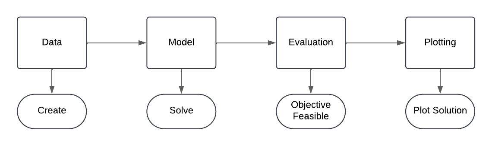

# QCHALLenge-FW

**A software framework for facilitated quantum modelling of industry use cases**

---

### Installation Methods

#### 🔹 Full Installation

You can use a package manager of your choice.
We recommend creating a virtual environment, such as Anaconda.
This will install all dependencies at once:

```bash
conda create -n qcframework python==3.11
pip install -r all_requirements.txt
```

---

#### 🔹 Selective Installation

Launch the interactive installer:

```bash
python installer.py
```

Select the use cases you want to install, then click **Install Selected Use Cases** and close the installer window.

This will create an python environment  `venv`, containing all required packages.

---


#### 🔹 Sequential Installation *(Optionally, if the versions above don’t work)*

Install the use cases manually one by one:

```bash
conda create -n qcframework-{use-case} python==3.11
```

Then for each use case:

```bash
cd {use-case folder}
pip install -r requirements.txt
cd ../  # return to root folder
```

---

### Execute Examples

In the `examples` folder, you’ll find Python files containing example scripts, named with the pattern `{use-case}_example`.

To run an example, use a command like:

```bash
python examples/pas_example_cplex.py
```

Each example illustrates the complete workflow: generating data, building the model, solving it, and visualizing the solution.

---
### Use the QCHALLenge Framework for Your Own Projects

You can import the framework into your custom Python projects:

```python
from qchallenge_framework import QCHALLengeFramework
```

and setting the path variables correctly. Use

```python
qc_fw = QCHALLengeFramework()
qc_fw.get_use_case_names()
```

to invoke the framework and learn about the pre-installed use cases.

---

### Contribute with Your Own Use Cases

1. Adding New Use Cases

When you want to add a new use case, we recommend starting with one of the existing examples as a template.  
You'll typically need these functions:

- `data.gen_problem()`: to create a new problem instance.
- `model.solve()`: to solve your problem.
- `evaluation.get_objective()`: to get the objective value.
- `evaluation.check_solution()`: to check if constraints are violated.
- `plot.plot_solution()`: to visualize your solution.



If you follow the modular design and naming conventions from the architecture section, your new use cases will plug right into the existing execution pipeline without any difficulty.


2. Once you have added all classes and functions, you can start installer.py.
There, click on Add New Use Case.
Make sure every single letter is correct. For model classes, only use a comma without a space between the classes.

3. Select all use cases and click Install.

---

### License

This project is licensed under the [Apache License 2.0](LICENSE.txt).  
To use parts of the code in a non-production environment, additional [Gurobi](https://pypi.org/project/gurobipy/) and [CPLEX](https://pypi.org/project/cplex/) licenses are required.  
Please read the license statements carefully before using or distributing the code.

---

### Funding
QCHALLenge is supported by:

<a href="https://www.bmftr.bund.de/"></a>


